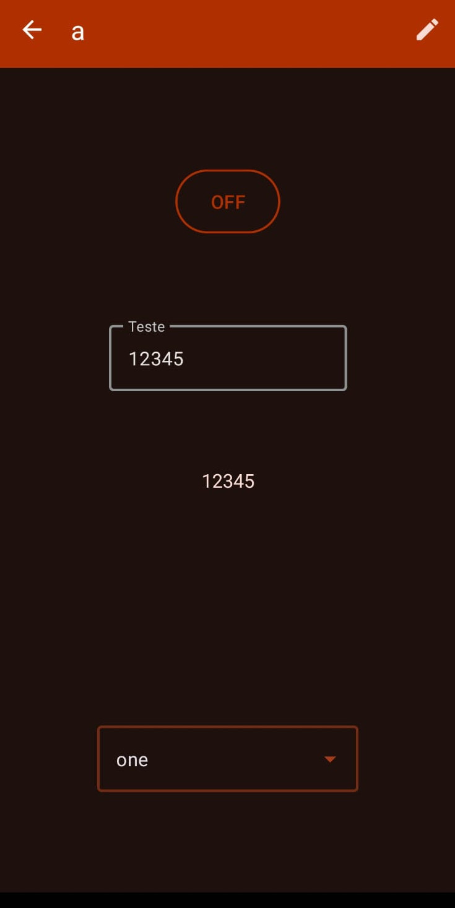

# 🔥 Ember IoT – Host Your Own IoT Cloud

Ember IoT is a simple proof of concept for a Firebase-hosted IoT cloud designed to work with Arduino-based devices and
an Android mobile app. It enables microcontrollers to connect to the cloud, securely sync data, and interact with a
mobile interface all while using the Firebase Authentication and Firebase Realtime Database services.

**This project's aim is to enable you to create a simple IoT infrastructure without all the hassle of setting up a
server in your home network or in a cloud provider.**

**This project is designed to be the front-end of the Arduino library of the same name, [check it out here](https://github.com/davirxavier/ember-iot-arduino).**

---

## 🔍 What Is Ember IoT?

Ember IoT allows you to:

- Connect Arduino and similar microcontroller devices to the cloud
- Interact with your devices in real-time using an Android app
- Securely authenticate users and devices with Firebase Authentication
- Store and sync your microcontroller state between devices

This project includes an Android application that features device management and a customizable UI for interacting with
connected devices. Alternatively, the Ember IoT library can also be used for microcontroller-to-microcontroller
communication, allowing devices to communicate directly without the need for the Android app.

---

## ❓ Why Would I Use Firebase for IoT?

### Short Answer:

Firebase’s free Spark plan from Google seems to be suitable for handling small-scale IoT projects — potentially
supporting dozens of devices with real-time data sync and built-in user authentication. This enables you to create a
simple IoT infrastructure without all the hassle of setting up a server in your home network or in a cloud provider.

### Detailed Answer:

Most free-tier IoT platforms come with major limitations:

- Device limits (e.g., only a few devices without paying)
- Strict quotas on messages, data storage, or connection time
- High costs to unlock even basic scalability

Firebase, on the other hand, offers:

- Real-time sync with low bandwidth
- Simple and secure authentication with support for email and password
- A relatively generous free tier under the Spark plan:
    - 100 simultaneous database connections (each microcontroller and Android device will use 1 connection slot)
    - 1 GB storage (each device will use 1-10kb of storage, approximately)
    - 50,000 reads/day, 20,000 writes/day

This could make Firebase a compelling backend for IoT hobbyists, educators, and developers looking for an easy-to-use
platform with minimal upfront cost. You have the flexibility to decide exactly how much you need and tailor your setup
accordingly, optimizing it as your project grows. This ensures you’re not bound by the limitations of third-party
platforms, giving you full control over your project’s scalability and requirements.

Plus, you don't have to enter any credit card info to create a project :)

---

# 🔥 Firebase Setup

See the [firebase project setup tutorial](https://github.com/davirxavier/ember-iot-arduino/blob/main/FIREBASE_SETUP.md).

---

# Arduino Setup

See the [EmberIoT Arduino library repository](https://github.com/davirxavier/ember-iot-arduino) for details on how to
use the Arduino library.

---

# 📱 App Setup

### Installation Instructions:

1. Download the `.apk` file from the releases and install it on your Android device.
2. Open the app, and you will be presented with instructions to guide you through the setup process. In summary, you'll need to upload a `google-services.json` file within the app and log in using the credentials you created during the Firebase setup.

---

### Features

- **Firebase Integration**  
  Connect your app to your own Firebase project.
    - Easily set up and configure Firebase as your backend for storing and managing device data.
    - Securely sync device data with Firebase to enable real-time updates.

 

- **Device List**  
  View and manage all your connected devices in the app's home.
    - Add new devices.
    - Edit or delete existing devices.
    - Long-press on any device to copy its unique device ID for use with the Arduino library.

- **Data Channels**
    - Create and configure data channels to communicate between the app and devices.
    - Bind UI elements to specific data channels for real-time updates.

- **Device Screen**  
  Access the specific interface for each device.
    - View the device’s UI elements and status.
    - Add new UI elements like text fields and buttons.
    - Configure properties of each element, such as size, color, and functionality.
    - Select and bind UI elements to specific data channels for integration with your microcontrollers.

---

# 📝 TODO

- [ ] Notification service
- [ ] Add the option to disable and re-enable "Developer mode" (edit mode)
- [ ] Add more UI elements
- [ ] Make the layout contrast better in a few places
